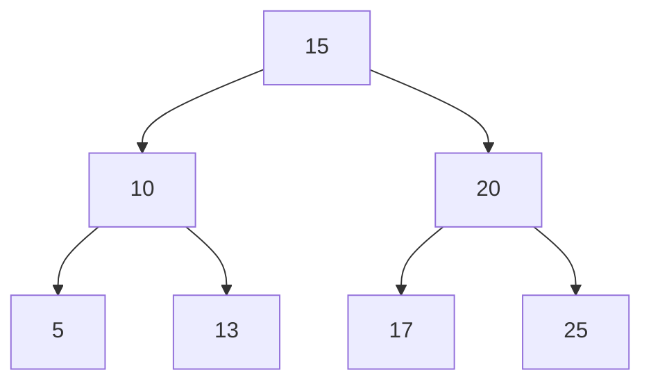

<h1> Create integers that cannot be displayed </h1>

In this repository, you will see a C project that I had to do during my 2nd year of Bachelor Degree. This project implements list, AVL tree and hash table.  

You will find 3 parts : 

- Create an integer that cannot be displayed normally (I will use list of integer) 
- Create a tree of big integers (particularly an AVL tree) 
- Create a hash table of big integers 

<h2> Introduction </h2>

In this project, I will use some lists of integers (included between 0 and 9). Indeed, in C we are limited (as every language) in the type size of numbers. 

  
| TYPE | SIZE (BITS) | SIZE (BYTES) | SET |
|---|---|---|---|
| CHAR | 8 | 1 | $[ -2^{-7} , 2^{7}-1 ]$ |
| INT | 32 | 4 | $[ -2^{-31} , 2^{31}-1 ]$ |
| FLOAT | 32 | 4 | $[ -2^{-31} , 2^{31}-1 ]$ |
| DOUBLE | 64 | 8 | $[ -2^{-63} , 2^{63}-1 ]$ |
  

However, there are more type possible (we can add short, long, unsigned, ...), so to see further information click on the link to go <a href="https://en.wikipedia.org/wiki/C_data_types">to the Wikipedia page</a>. 

PS : type size can depend of the computer

<h2> Creating list of integers </h2>

To begin, we will create a structure called **cellule** (cell in french) that include an integer and a pointer of "cellule" that it will be used to make a link between the current cell and the next one. 

Then, we need to write some functions as :
- CreateList(int element, Liste rest) : Add an element at the beginning of the list
- head(List L) : Get the first element without deleting him
- tail(List L) : Get the list without the first element
- isEmpty(List L)

<table align="center">
  <tr>
    <td>CreateList function</td>
    <td>Head function</td>
  </tr>
  <tr>
    <td></td>
    <td></td>
  </tr>
  <tr>
    <td>Tail function</td>
    <td>isEmpty function</td>
  </tr>
  <tr>
    <td></td>
    <td></td>
  </tr>
</table>

So now, we can write a function that it creates a big integer. The function consists of asking a string (for example "154987621") that includes a maximum of 199 letters. There is no verification of the string but we could easily do it.

<h2> Creating AVL tree of big integer</h2>

Before creating an AVL tree, we should create a normal tree before. So, we need to create another structure called **arbre**. A tree is similar to a list but we have two links (since we are working on binary trees here). 

In order to save time, we will directly sort the elements in our tree (let's look at the example). 

- The left child must be less or equal than the node
- The right child must be greater than the node

To transform our tree in an AVL tree, we need to some rotations when we add a big integer (since an AVL tree try to minimize the height of the tree that we can see above thanks to "requilibre"). To do that, we need a function which compares two big integers, and rotation function (left, right, left-right, right-left).

<table align="center">
  <tr>
    <td colspan="2" >Comparison function</td>
  </tr>
  <tr>
    <td colspan="2" align="center"></td>
  </tr>
  <tr>
    <td>"Balance" function</td>
    <td>Rotation functions</td>
  </tr>
  <tr>
    <td></td>
    <td></td>
  </tr>
</table>

<h2> Creating hash table of big integer</h2>

This final part is by the way the easier part. The first step is to create an array of big integer. Then when we add an element, we will calculate a key in order to calculate an index. Moreover, we have a constant called "theta", it modify the distribution of big integers. So to have the best distribution, we need to have a complex key and a special constant for theta (either $\frac{1+\sqrt{5}}{2}$ or $\frac{\sqrt{5}- 1}{2}$ because it's the golden ratio which have the best distribution).

<table align="center">
  <tr>
    <td>Key calculation function</td>
    <td>Index calculation function</td>
  </tr>
  <tr>
    <td></td>
    <td></td>
  </tr>
</table>
